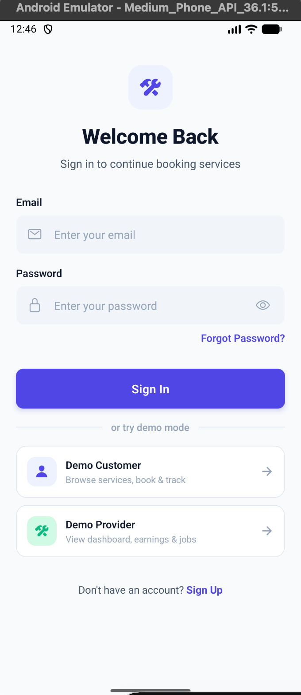
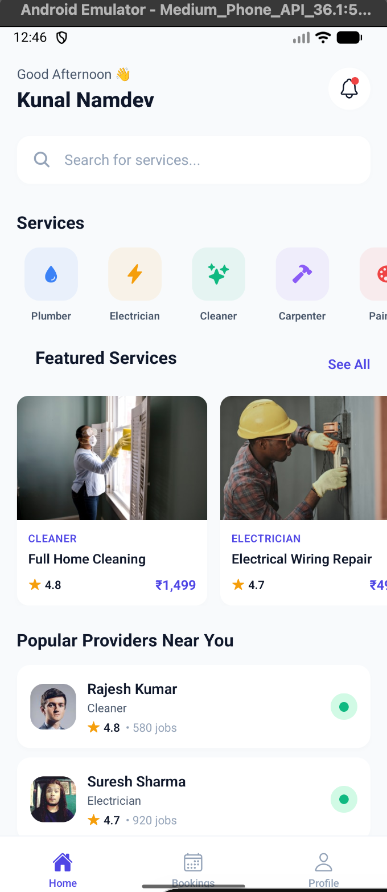
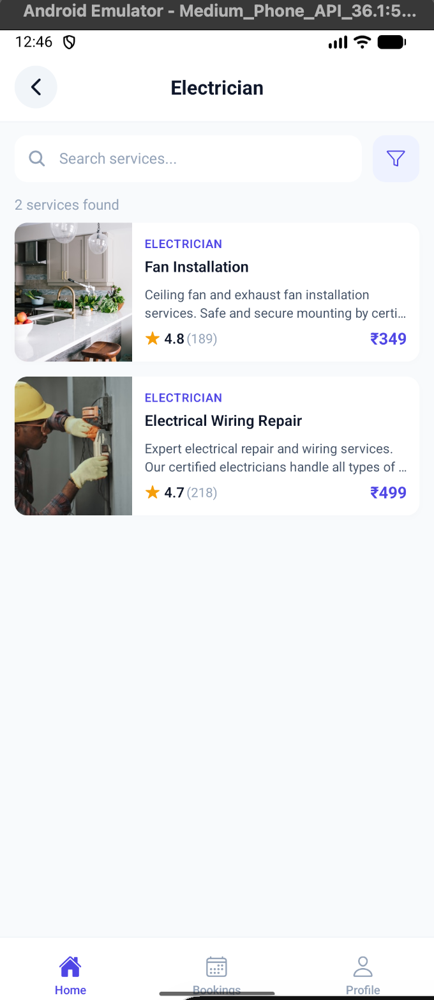
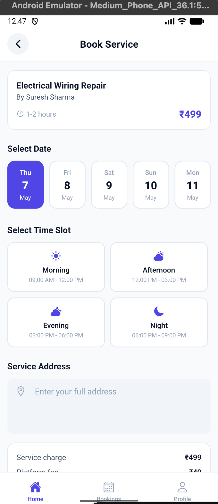

# 🔧 ServeNow — Hyperlocal Home Services Booking App

A full-featured, cross-platform mobile app for booking home services (like Urban Company). Built with **React Native + Expo**, powered by **Firebase**.

> 📱 Two user roles: **Customer** (book services) & **Service Provider** (manage jobs)

---

## 📸 Screenshots

<!-- Drop your screenshots in the /screenshots folder and they'll show up here -->

| Login |
|:---:|
|  |

| Home Screen | Service List | Service Detail |
|:---:|:---:|:---:|
|  |  |  |

| Booking |
|:---:|
|  |


---

## ✨ Features

### 👤 Customer
- 🏠 Browse 6 service categories (Plumber, Electrician, Cleaner, Carpenter, Painter, AC Repair)
- 🔍 Search and filter services by price or rating
- 📋 View detailed service info, pricing, and customer reviews
- 📅 Book services with date, time slot, and address
- 📍 Track booking status in real-time (5-step stepper)
- 📜 View booking history with filter tabs (All / Active / Completed / Cancelled)
- 👤 Profile management with photo upload

### 🔧 Service Provider
- 📊 Dashboard with today's jobs, earnings, and rating stats
- 📩 Incoming booking requests with Accept/Reject actions
- 💼 Job detail view with Start Job / Complete Job workflow
- 💰 Earnings overview with bar chart and job history
- 🟢 Online/Offline availability toggle
- 👤 Profile management with services and experience

### 🔐 Authentication
- Email/Password signup with role selection
- Login with form validation and error handling
- Forgot password with Firebase reset email
- Demo mode for instant testing (no signup needed)

---

## 🛠️ Tech Stack

| Technology | Purpose |
|:---|:---|
| **React Native + Expo** | Cross-platform mobile framework |
| **React Navigation v6** | Stack + Bottom Tab navigation |
| **Firebase Auth** | User authentication |
| **Cloud Firestore** | Real-time database |
| **Firebase Storage** | Profile image uploads |
| **Context API** | State management |
| **Expo Vector Icons** | Icon library (Ionicons) |
| **Custom StyleSheet** | Modern, production-grade UI |

---

## 📁 Project Structure

```
ServeNow/
├── App.js                     # Entry point
├── firebase.js                # Firebase config (gitignored)
├── firebase.example.js        # Template for Firebase config
│
├── src/
│   ├── screens/
│   │   ├── auth/              # Splash, Onboarding, Login, Signup, ForgotPassword
│   │   ├── customer/          # Home, ServiceList, ServiceDetail, Booking, Track, History, Profile
│   │   └── provider/          # Dashboard, JobDetail, Earnings, Profile
│   │
│   ├── components/            # Button, Input, ServiceCard, BookingCard, StatusBadge, StarRating...
│   ├── navigation/            # RootNavigator, AuthNavigator, CustomerNavigator, ProviderNavigator
│   ├── context/               # AuthContext (login, signup, logout, demo mode)
│   ├── services/              # firebaseService.js, notificationService.js
│   ├── constants/             # colors.js, typography.js, mockData.js
│   └── utils/                 # helpers.js (formatting, validation, utilities)
│
├── assets/                    # App icons and splash screen
└── screenshots/               # App screenshots for README
```

---

## 🚀 Getting Started

### Prerequisites
- Node.js (v18+)
- Expo CLI (`npm install -g expo-cli`)
- Expo Go app on your phone ([Android](https://play.google.com/store/apps/details?id=host.exp.exponent) / [iOS](https://apps.apple.com/app/expo-go/id982107779))
- Firebase project ([console.firebase.google.com](https://console.firebase.google.com))

### Installation

```bash
# 1. Clone the repo
git clone https://github.com/Kunal-Tailor/UrbanDoor.git
cd UrbanDoor

# 2. Install dependencies
npm install

# 3. Set up Firebase
cp firebase.example.js firebase.js
# Edit firebase.js and add your Firebase credentials

# 4. Start the app
npx expo start
```

### Firebase Setup
1. Create a project at [Firebase Console](https://console.firebase.google.com)
2. Enable **Authentication → Email/Password**
3. Enable **Cloud Firestore** (start in test mode)
4. Enable **Storage**
5. Add a Web App and copy the config to `firebase.js`

### Demo Mode
Don't want to set up Firebase? Just tap **"Demo Customer"** or **"Demo Provider"** on the Login screen to explore the full app with pre-loaded data.

---

## 🗄️ Firestore Database Schema

```
users/{userId}
├── name, email, role, phone, profileImage
├── savedAddresses[]          (customer)
├── services[], isOnline, rating, completedJobs  (provider)

bookings/{bookingId}
├── bookingId, userId, serviceId, providerId
├── serviceName, category, price
├── date, timeSlot, address, status

reviews/{reviewId}
├── serviceId, userId, userName, rating, comment
```

---

## 📦 Key Dependencies

| Package | Version | Purpose |
|:---|:---|:---|
| expo | ~54.0.0 | Expo SDK |
| @react-navigation/native | ^7.x | Navigation core |
| @react-navigation/stack | ^7.x | Stack navigator |
| @react-navigation/bottom-tabs | ^7.x | Bottom tab bar |
| firebase | ^11.x | Firebase SDK |
| expo-image-picker | ~17.x | Photo selection |
| expo-notifications | ~0.32.x | Push notifications |
| react-native-maps | 1.20.x | Map display |

---

## 🏗️ Build & Deploy

```bash
# Install EAS CLI
npm install -g eas-cli
eas login

# Build Android APK (testing)
eas build --platform android --profile preview

# Build Android AAB (Play Store)
eas build --platform android --profile production

# Build iOS (App Store)
eas build --platform ios --profile production
```

---

## 👨‍💻 Author

**Kunal Tailor**
- GitHub: [@Kunal-Tailor](https://github.com/Kunal-Tailor)

---

## 📄 License

This project is for educational and portfolio purposes.
